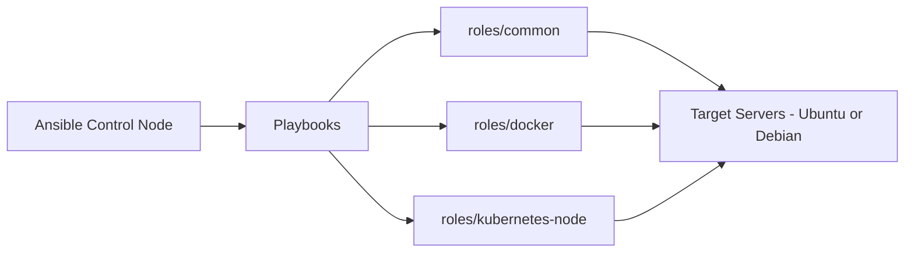

# Ansible Playbooks Collection

Collection of reusable Ansible playbooks and roles for infrastructure provisioning and automation.  
These playbooks reflect real-world usage in deploying and maintaining systems for Ethiopian government health facilities and banking clients.

### What This Demonstrates
- Server hardening and common package installation
- Docker and container runtime setup
- Kubernetes node preparation (for RKE2)
- Modular role-based structure following Ansible best practices
- Idempotent and reusable automation

### Tech Stack
- Ansible
- Docker
- Kubernetes (RKE2)
- Linux (Ubuntu/Debian)
- YAML

### Files & Structure
- `playbooks/` — Ready-to-run playbooks
- `roles/` — Reusable roles (best practice)
- `inventory.ini` — Example inventory file
- `ansible.cfg` — Basic configuration

### Available Playbooks
- `setup-docker.yml` — Install and configure Docker
- `kubernetes-node-prep.yml` — Prepare nodes for RKE2 cluster
- `common-setup.yml` — Server hardening and common tools

### How to Use
```bash
# Run a playbook
ansible-playbook -i inventory.ini playbooks/setup-docker.yml
```

## Real-World Application
I have used these playbooks (or very similar ones) to automate server provisioning and Docker/Kubernetes setup across multiple health facilities and banking infrastructure. This significantly reduced deployment time and ensured consistency across environments.

## Workflow Overview


# Run with become (sudo)
ansible-playbook -i inventory.ini playbooks/setup-docker.yml --become
